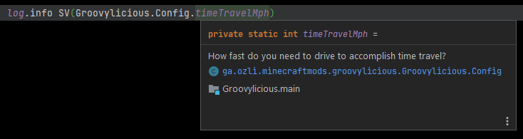

[](https://www.curseforge.com/minecraft/mc-mods/groovylicious)

*Delicious syntax sugar with the power of Groovy!*

## About

Groovylicious is a mod that eases development of Minecraft Forge mods by providing Groovy APIs, DSLs and compile-time AST transformations. This results in cleaner, easier to understand code with reduced boilerplate and ceremony for mod developers.

## Features

### `@ModConfig`

While Forge already provides a config system, Groovylicious further simplifies the use of it by letting you simply write a standard dataclass and annotating it with `@ModConfig`.

When you do this, Groovylicious generates all the necessary code at compile-time to transparently register and manage your mod's config with the Forge config system. This means that you can then access and change the variables directly and they'll be reflected in the underlying config file.

#### Demo

The config class:

```groovy
@ModConfig(modId = 'groovylicious')
static class Config {
    
    /** How fast do you need to drive to accomplish time travel? {@range 50..100} */
    static int timeTravelMph = 88

    /**
     * Fox rotation speed in RPM
     * 100 is slow, 9999 is fast
     * {@range 100.0..9999.0}
     */
    static double foxRotation = 9000.42d // note: the {@range} is optional

    /** How far are you willing to walk to see the messiah? (in blocks) */
    static long willingToWalkDistance = 2000L

    /** The holy words of the messiah's mother */
    static String lifeOfBrianQuote = "He's not the messiah, he's a very naughty boy!"

    /** Is the parrot alive? */
    static boolean parrot = false

    // this method's just here to load this config class
    static void init() {}
}
```

Usage:

```groovy
println "Is the parrot alive? ${Config.parrot}"

if (!Config.parrot) {
    Config.parrot = true // revive the parrot
}

println "How about now? ${Config.parrot}"
```

#### Bonus features

This approach provides a couple of bonus features for free, such as supporting Groovy's transparent get/set feature and full IDE support:

```groovy
// In Groovy, getters/setters/variable access are usually interchangeable for public fields
Config.getParrot() // works
Config.setParrot(true)

Config.parrot // also works
Config.parrot = true

// The Forge config system way without Groovylicious - must always call get()/set() 
// in order to get/set the underlying value we care about
Config.parrot.get()
```



### Colour API
This API helps you use consistent colours in your code (and across mods) without having to worry about the exact colour values. It also provides a convenient way to use the same colours that Minecraft GUIs use without needing to check the constants by hand.

First is the `Colour` type: this lets you make a colour from a packed int, (A)RGB values or `ChatFormatting`. You can then grab individual colour channels from this `Colour` type and optionally register it to the `Colours` registry.

The `Colours` registry is like an expandable enum that contains colours used by Vanilla Minecraft and other mods, facilitating consistency and providing a central place to store your `Colour`s. All of Vanilla's `ChatFormatting` colours are also available here.

#### Demo

```groovy
import ga.ozli.minecraftmods.groovylicious.api.gui.Colour
import static ga.ozli.minecraftmods.groovylicious.api.gui.ColoursRegistry.instance as Colours

final Colour orange = new Colour(red: 255, green: 165, blue: 0)
println SV(orange) // prints orange=Colour(packed: -23296, argb: [255, 255, 165, 0])
println orange.getRed() // prints 255
println orange.packed // prints -23296
println orange.RGB // prints [255, 165, 0]

Colours.EDITBOX_TEXT // returns the text colour used inside edit boxes in Minecraft

Colours.ORANGE = orange // register the orange colour we made earlier so that it can be used anywhere
```

### `ExtensibleScreen` and Screen-related DSLs
ExtensibleScreen provides a way of creating screens at runtime and hooking into specific parts of overriden methods such as `init()` and `render()`.

The DSL provides an alternative way of creating Screens and the widgets that go on them. Aspects such as drawing text shadows, alignment, colouring and TextComponent vs TranslationComponent are simplified and no longer require calling different methods or creating specific types.

If you need to perform custom rendering or init logic, you can modify the appropriate `Closure` list in the `ExtensibleScreen` instance (such as `onPreRender`) or use the appropriate closure in the DSL (such as `onPreRender { /* custom pre-render code here */ }`).

#### Demo

```groovy
import ga.ozli.minecraftmods.groovylicious.dsl.ScreenBuilder

static Screen makeDemoScreen() {
    return new ScreenBuilder().makeScreen("Demo Screen") {
        println title // prints TextComponent{text='Demo screen', ...}
        drawBackground = true
        
        button {
            text = "demo.clickMe"
            position x: 10, y: 10
            size x: 100, y: 20
            onClick {
                println "Clicked!"
            }
        }
        
        label {
            text = "Demo label"
            position x: 10, y: 40
            colour = Colours.ORANGE
        }
    }
}
```